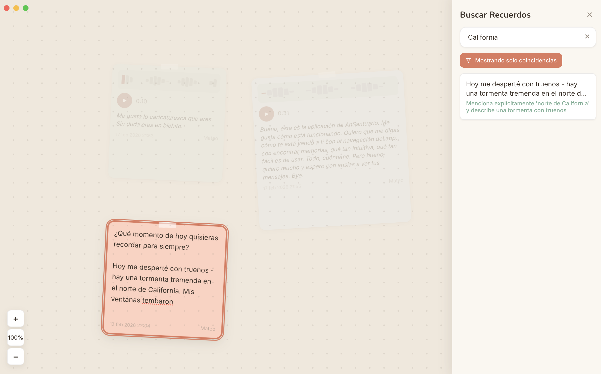

# Ansantuario

A shared memory wall for two people who love each other. Built with Electron, React, and Firebase.

Drop text notes, voice memos, and links onto an infinite canvas that syncs in real time between two devices — no matter the distance.

[See it in action](https://vimeo.com/1165906210?fl=pl&fe=ti)





## Features

- **Infinite canvas** — pan, zoom, and scatter notes anywhere
- **Text notes** — write whatever's on your mind
- **Voice notes** — record and play back, with automatic Spanish transcription (Groq Whisper)
- **Link notes** — paste a URL and get a rich preview
- **Photo notes** — upload images with optional captions
- **AI search** — find memories by meaning, not just keywords (Claude)
- **Daily question** — a reflective prompt each day to keep you connected, with gap-aware topic detection
- **Sentiment analysis** — each note is analyzed for emotional tone and tagged with emotions like amor, nostalgia, gratitud
- **AI photo descriptions** — Claude Vision auto-describes uploaded photos, making them searchable
- **Voice note summaries** — after transcription, Claude generates a short summary and detects emotional tone
- **Related memories** — select any note to discover thematically connected memories
- **Weekly digest** — generate a narrative summary of the past week's shared memories, themes, and highlights
- **Milestone detection** — AI detects anniversaries, recurring themes, streaks, and firsts worth celebrating
- **On This Day** — resurface memories from the same date in past years
- **Reactions** — react to notes with heart, smile, flame, sparkle, abrazo, or teardrop
- **Presence indicators** — see when the other person is online
- **Background music** — ambient soundtrack with fade in/out
- **Password protected** — each person picks their identity on first launch
- **Real-time sync** — everything appears instantly on both screens via Firestore

## Make It Yours

This was built for two specific people, but you can fork it and make it your own. Here's what to set up:

### 1. Firebase

Create a free project at [console.firebase.google.com](https://console.firebase.google.com):

- Enable **Cloud Firestore** (start in test mode)
- Register a **Web app** and copy the config values

Firestore will have two collections (created automatically):
- `notes` — all your shared notes
- `daily_questions` — one doc per day (ID = `YYYY-MM-DD`)

### 2. API Keys

| Service | What it does | Where to get it |
|---------|-------------|-----------------|
| **Anthropic** | AI-powered search + daily question generation | [console.anthropic.com](https://console.anthropic.com) |
| **Groq** | Voice note transcription (Whisper, free tier) | [console.groq.com](https://console.groq.com) |

### 3. Environment

Copy the example and fill in your values:

```bash
cp .env.example .env
```

Then fill in every field in `.env`. See `.env.example` for the full list.

### 4. Personalize

A few things you'll want to change:

- **Identity names** — in `src/renderer/src/types/note.ts`, change the `UserIdentity` type from `'marielisa' | 'mateo'` to your own names. Also update `src/renderer/src/components/auth/PasswordScreen.tsx` where the names appear in the UI.
- **Login subtitle** — in `PasswordScreen.tsx`, change the first-launch message to whatever fits you two
- **Starter questions** — in `src/main/daily-questions.ts`, the 18 reflective prompts are in Spanish. Swap them for your language or style.
- **Background music** — replace the audio file in the project with your song and update `src/renderer/src/lib/audio.ts`

## Run

```bash
npm install
npm run dev
```

## Build

```bash
npm run build:mac
```

The `.dmg` will be in `dist/`. Send it to your person — they just install and go. No dev setup needed on their end.

## Stack

- **Electron** + **electron-vite** — desktop shell
- **React 19** — UI
- **Firebase** (Firestore) — real-time sync
- **Zustand** — state management
- **Motion** (Framer Motion) — animations
- **Anthropic Claude** — semantic search, question generation, sentiment analysis, photo descriptions, related memories, weekly digests, milestone detection
- **Groq Whisper** — speech-to-text

## License

MIT — make something beautiful for someone you love.
